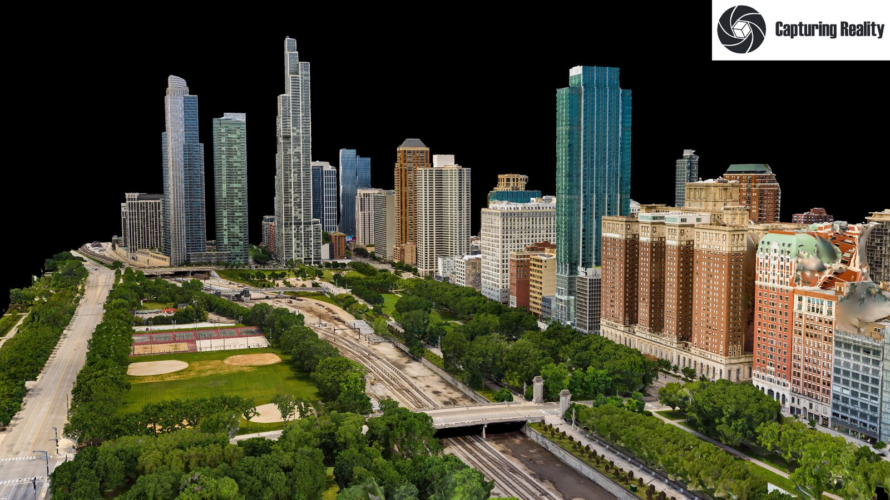
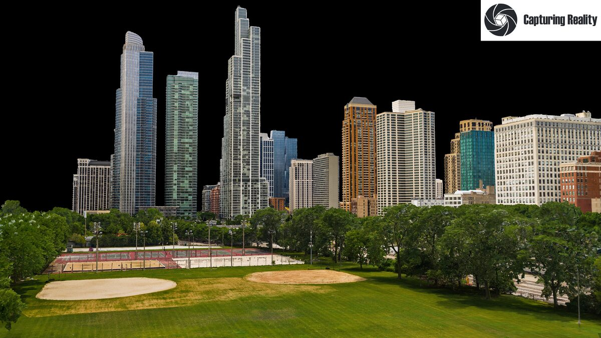
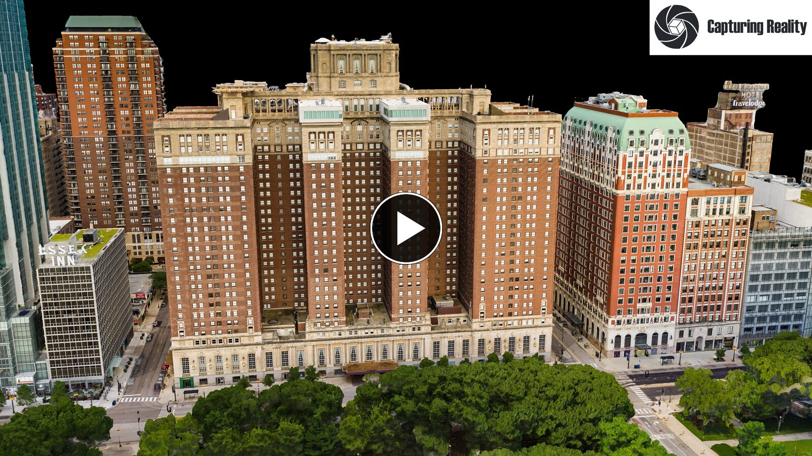
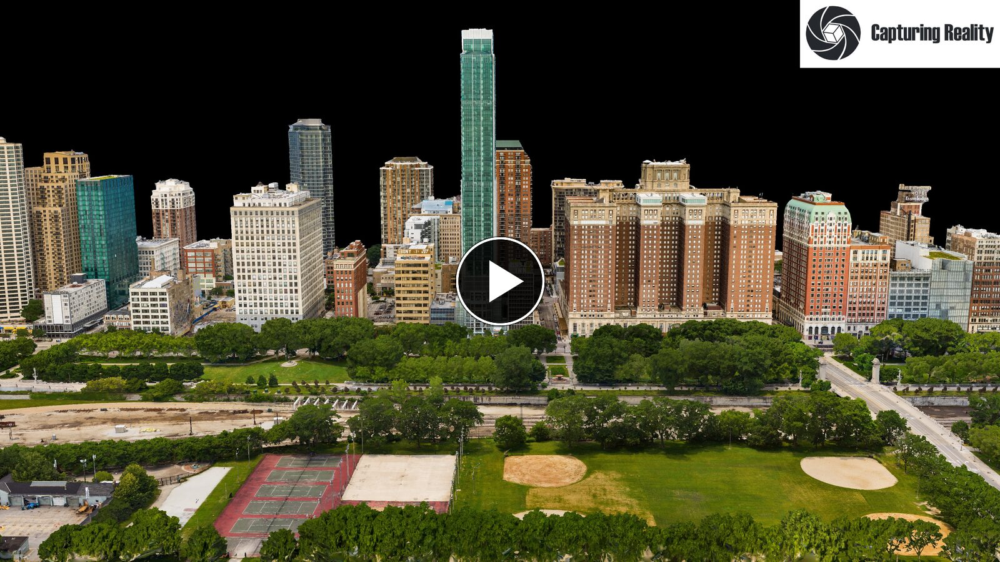
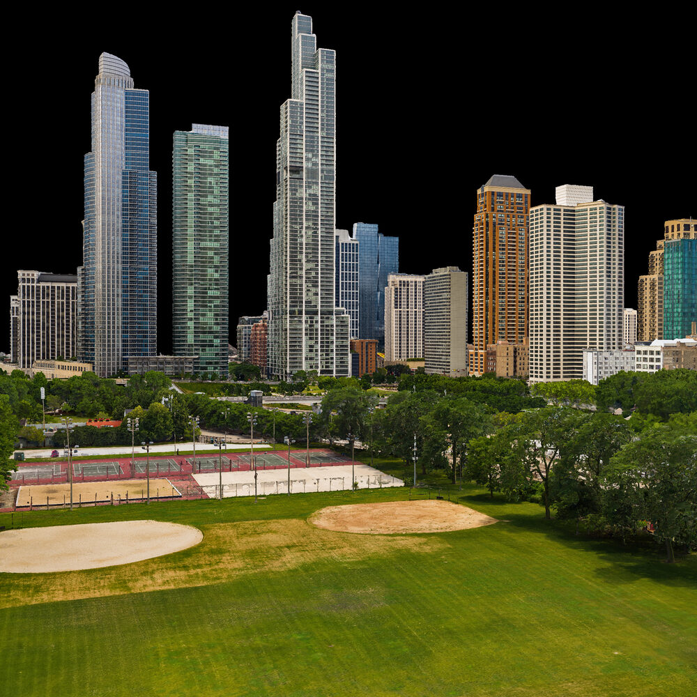
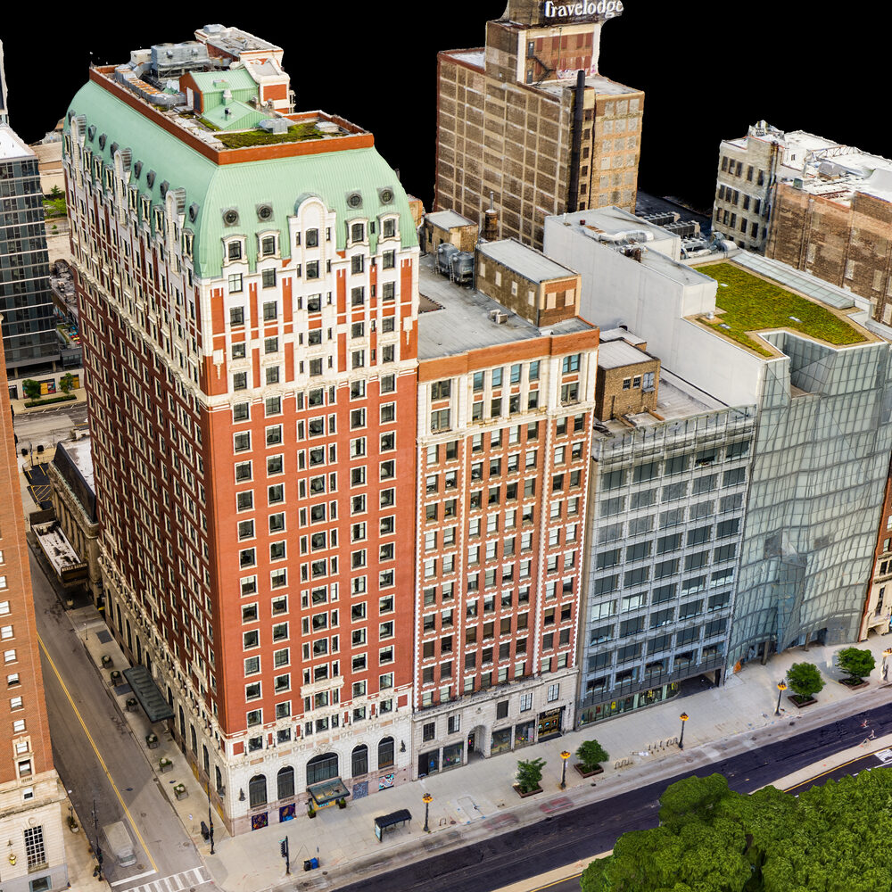
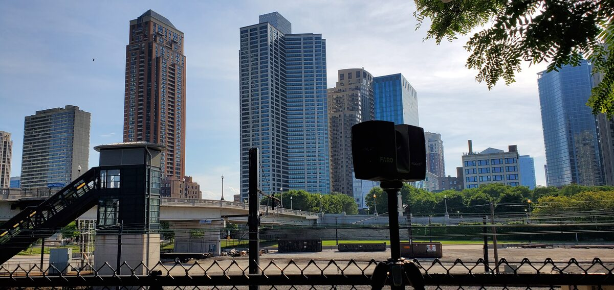
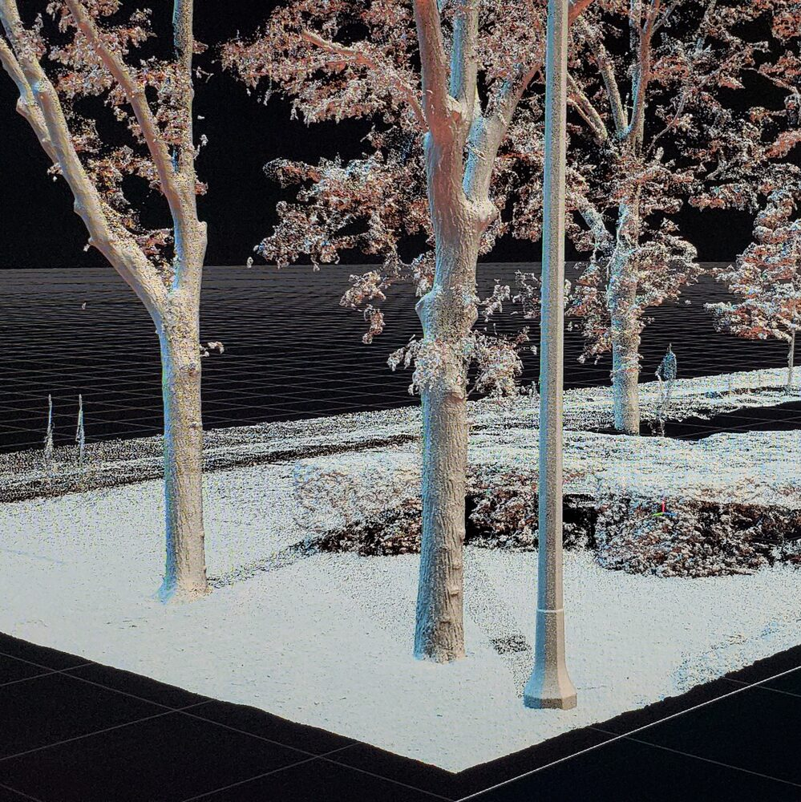

# Chicago / Grant Park — Aerial Photogrammetry + Terrestrial Laser Dataset

**2,751 full-resolution aerial photographs (41.9 GB) and 43 terrestrial laser scan stations
of downtown Chicago's Grant Park, captured June 2020.**
Released under CC BY 4.0 — free for commercial, academic and ML use with attribution.

> ## 🏆 Winner — RealityCapture #RCmonthlyChallenge, August 2020
>
> This reconstruction and its [companion tree scan](https://github.com/Matt1Up/tree-photogrammetry-dataset) were both named
> winners of Capturing Reality's monthly challenge, announced by **RealityScan** — the makers
> of RealityCapture — on 17 September 2020 in
> **[Winners of AUGUST #RCmonthlyChallenge ▶](https://www.youtube.com/watch?v=PfzdaZbUrFc)**.
>
> The video description credits the win as *"@Matt1up — Tree and Chicago city"*, and the
> Chicago model appears in the reel under a `created by: @Matt1up` title card.



---

## Why this exists

In late June 2020 the Grant Park festival grounds were empty. Lollapalooza had been
cancelled for the first time in decades, and the field where a hundred thousand people should
have been standing was just grass.

A friend was playing a set for the virtual Lollapalooza that replaced it, and wanted the
Chicago skyline behind him. **That is the entire reason this capture exists.**

Which is why the dataset is deliberately uneven, and that unevenness is the interesting part:

- **The city is drone photogrammetry** — 2,751 aerial frames covering the skyline, Michigan
  Avenue frontage and the surrounding blocks. Enough to reconstruct a convincing backdrop.
- **The festival field is terrestrial laser** — 43 scan stations concentrated on that specific
  patch of ground, at far finer detail than anything around it. The field was the actual
  subject. The rest of downtown Chicago was scenery.



*The actual subject: the two softball diamonds and floodlit courts that Perry's Stage — the
festival's dance stage — is built over. In any other summer this frame holds a crowd.*

So you get a large-area urban capture with one patch of ground resolved to a much tighter
tolerance than the rest, because that patch was the whole point. Datasets with that property
are not easy to find, and it is not a flaw to be corrected — it is a real capture strategy,
driven by an actual deliverable.

It is also, incidentally, a record of a specific and strange moment. One of the most crowded
places in an American summer, photographed completely empty — and not just the festival field.
Downtown Chicago itself was clear. Empty streets, empty plazas, empty park, in a way that city
had not been in living memory and has not been since.

That is the real reason this dataset is worth keeping. **The conditions that made it possible
do not come back.** A capture of this area at this density, with the ground and the streets
this unobstructed, cannot simply be reflown by someone who decides they want one.

## Why it is being released

Public photogrammetry datasets at this scale are rare, and the ones that exist are usually
downsampled, stripped of metadata, or synthetic. This is the **complete, unmodified source
capture** behind a finished large-area reconstruction — original camera JPEGs straight out of
the Lightroom export that fed the solve, with EXIF and GPS intact, organised by the flight
that produced them.

You can reproduce the reconstruction, benchmark your own pipeline against it, or pull the
low-altitude building orbits out and use them on their own.

## The reconstruction

[](https://vimeo.com/486278234/2233b44140)

*Grant Park flythrough — click to watch on Vimeo*

[](https://vimeo.com/485263221)

*Creation reel — the capture and processing pipeline, click to watch on Vimeo*

Full project write-up: **[mattguertin.com/portfolio/chicago](https://mattguertin.com/portfolio/chicago/)**

| | |
|---|---|
|  |  |

## What's in the dataset

| | |
|---|---|
| **Images** | 2,751 JPEG · 41.94 GB |
| **Sensor** | Hasselblad L1D-20c — 1" 20 MP CMOS (DJI Mavic 2 Pro) |
| **Resolution** | 5467 × 3582 (2,297) · 5464 × 3070 (400) · 5366 × 3575 (54) |
| **Lens** | 10.3 mm — 28 mm full-frame equivalent, f/2.8 |
| **Geotagging** | GPS lat/lon/altitude in EXIF — **valid on all 2,751**, none missing |
| **Bounds** | 41.867317 – 41.874759 N · −87.624511 – −87.619413 W |
| **Altitude** | 183 – 315 m above sea level |
| **Captured** | 27–28 June 2020, 06:52 to 19:49 |
| **Laser** | 43 scan stations — *see "Laser scans" below* |

### Capture groups

Images are named by the flight that produced them, so you can take a subset without
downloading everything.

| group | images | what it covers |
|---|---:|---|
| `Grid_Down_1` | 485 | nadir mapping grid, pass 1 |
| `First_Flight_` | 400 | initial site survey orbit |
| `Grid_Down_2` | 372 | nadir mapping grid, pass 2 |
| `Park_Overhead_` | 354 | park canopy and open ground, overhead |
| `Grid_Down_4` | 282 | nadir mapping grid, pass 4 |
| `Buildings_3` | 258 | facade orbit — Michigan Ave frontage |
| `Sunday_Night_Buildings` | 216 | low-light facade pass |
| `Buildings_2` | 154 | facade orbit |
| `Buildings_1` | 81 | facade orbit |
| `Grid_Down_3` | 54 | nadir mapping grid, pass 3 |
| `Buildings_4` | 54 | facade orbit |
| `Park_Trees_NEW` | 24 | tree canopy detail |
| `Sunday_Night_Street` | 17 | street-level low-light |
| **total** | **2,751** | |

## The capture rig



Aerial capture flown with a **DJI Mavic 2 Pro** (Hasselblad L1D-20c), covering the skyline and
surrounding blocks.

The **FARO Focus S150** terrestrial laser scanner was not there to fill aerial gaps in general
— it was pointed at the festival field specifically, which needed to hold up under close
inspection in a way the background skyline did not. It also captures what a drone structurally
cannot: the ground plane, building bases, and the underside of tree canopy. A drone looks
down, so anything directly beneath a horizontal surface is invisible to it no matter how many
passes you fly.

## Download

The images are hosted off GitHub — this repository holds the documentation, manifests and
checksums. See **[docs/download.md](docs/download.md)** for mirrors and resumable download
instructions.

```bash
# sample pack first (~620 MB) — evaluate before committing to 42 GB
./scripts/download.sh --sample

# full image set
./scripts/download.sh --full

# a single capture group
./scripts/download.sh --group Grid_Down_1
```

Every file is checksummed. After downloading:

```bash
./scripts/verify.sh
```

## Reproducing the reconstruction

See **[docs/reproduce.md](docs/reproduce.md)** for step-by-step alignment settings.
The dataset aligns in RealityCapture / RealityScan, Agisoft Metashape, COLMAP and Meshroom.
Images carry GPS, so georeferencing works without ground control.

## Known characteristics

Read these before you file a bug — they are properties of the capture, not defects in the upload.

- **Three sensor crops appear in the set.** 5467 × 3582 for most of it, 5464 × 3070 for the
  `First_Flight_` group, and 5366 × 3575 for 54 frames. Same lens throughout; the solver should
  still be told to treat them as one camera.
- **These are Lightroom exports, not raw.** Developed from DNG in Lightroom Classic 9.3 with
  consistent settings across the set. Raw files are not part of this release.
- **The renders carry a "Capturing Reality" watermark.** The reconstruction was produced as a
  RealityCapture Challenge entry on a promotional licence. The watermark is left intact
  deliberately — it is part of the provenance. It appears only on the preview renders, never
  on the dataset images.
- **Overlapping coverage is intentional.** Several grid passes cover the same ground at
  different altitudes and times of day. That redundancy is what makes the set useful for
  studying pass-count and lighting effects, but it means naive "all images" alignment is
  slower than a curated subset.

## Laser scans



*Registered laser point cloud — Grant Park tree line and ground plane.*

The 43 terrestrial laser stations are **not in this initial release.** They currently exist
only in RealityCapture's internal `.lsp` format, which no other software can read. They are
being converted to **E57** (the open ASTM standard, readable by CloudCompare, Metashape,
Autodesk and Blender) and will ship as **v1.1**.

Watch this repository for the release, or open an issue if you need them sooner.

## Licence

[](https://creativecommons.org/licenses/by/4.0/)

Released under [Creative Commons Attribution 4.0 International](LICENSE).
**You may use this commercially, and you may train models on it.** You must give credit.

```
Chicago / Grant Park Aerial Photogrammetry Dataset — Matthew Guertin, 2020.
Licensed CC BY 4.0. https://github.com/Matt1Up/chicago-photogrammetry-dataset
```

See [CITATION.cff](CITATION.cff) for BibTeX and academic citation formats.

## Related

- **[Tree photogrammetry dataset](https://github.com/Matt1Up/tree-photogrammetry-dataset)** —
  812 images of a single tree, a controlled small-subject counterpart to this large-area set.
- **[mattguertin.com](https://mattguertin.com)** — portfolio and other work.

---

Captured, processed and released by **Matthew Guertin**.
If you build something with this, I would genuinely like to see it — open an issue.
